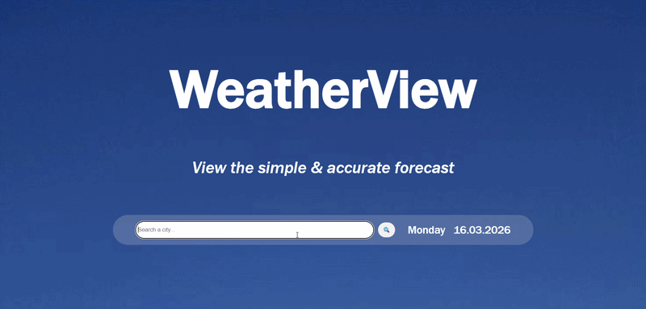

# Weather-App

## Description 📃
A simple weather application that shows the current weather with details and 5-day forecast using the OpenWeather API.

## Features 🔆
- Search weather by city all across the world with search button or `Enter`.
- View current temperature and other details of weather.
- View 5 day forecast.

## Technologies ⚙️
- HTML
- CSS
- JavaScript
- OpenWeather API
- Dayjs

🔗To view or use my project :
https://sonieez.github.io/Weather-App/

📽️How it looks:

